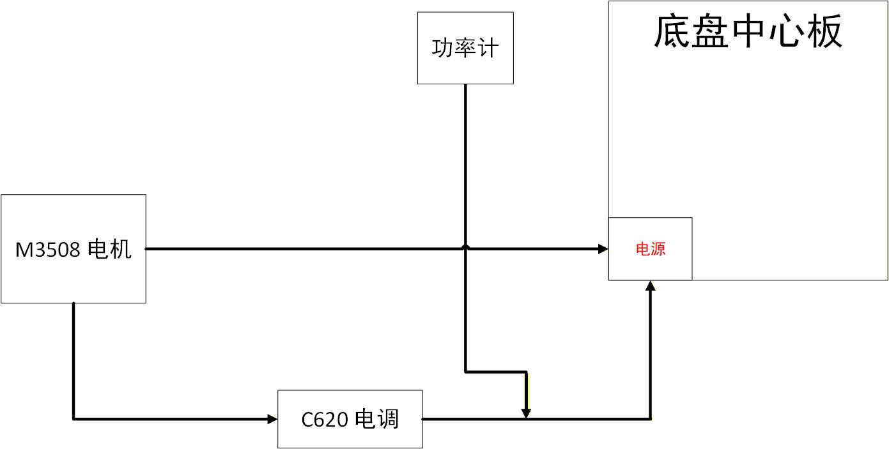

#  功率测算模型

## 理论

### 数据点公式来源

- $ P = Fv = BIL \times R \times \omega $
- $ P = f(I,\omega)$  Taylor expansion
- $P = k_0 +k_1\times I+k_2\times \omega +k_3\times I\omega +k_4 \times I^2 +k_5\times \omega^2$
- 测得若干组数据 $data(P,I ,\omega)$ 后，使用最小二乘法操作，可拟合得出$\vec{k} = (k_1,k_2,k_3,k_4,k_5)$
- 注意：测算的电流 I　是相电流，为电机实际返还的电流值，非目标电流，非通过电调的总电流

###　功率采集

- 使用功率计，连上CAN总线，烧录已经写好的代码到单片机中，控制串口返回各串数据  $data(P,I ,\omega)$ 

### 控制功率

- 功率衰减法
- 电流衰减法

## 实操

#### 接线

>
>
>
>
>- 底盘中心板
>- 7 * XT30 输出口
>- 4 * 电调占用 +  3 * 电机占用
>- 还一个电机连到哪里了？

#### 数据处理

>- 单向功率计
>  - 电压 电流 功率 电能
>  - 
>  - 
>
>