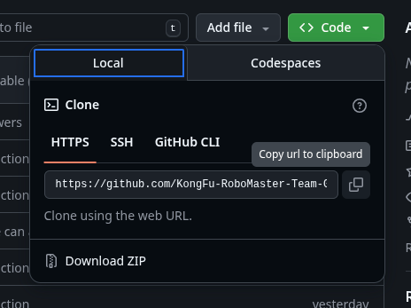
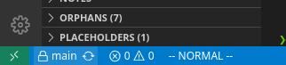

# git & vscode的git插件使用 & 个人代码进度同步中央仓库

## 环境安装 
我们在此统一使用vscode作为我们的开发环境，并且使用vscode的图形化界面来使用git进行个人代码进度同步

1. 打开vscode, 在左侧侧边栏找到extension, 搜索Github Action, Github Pull Requests这两个插件安装。安装左侧侧边栏会多出两个图标，一个像串珠的，一个是github那只猫的，分别是github action 和 github pullrequest

在此说明本文涉及的术语 
图标对应关系：
左侧侧边栏长得像串珠的---github action
左侧侧边栏长得像github那只猫的---github pull request

2. vscode里面左侧侧边栏最下面倒数第二个人像的图标，点开他，在里面登陆你的github账户。
登陆成功后点击github pull request, 如果能看到:

\/ pull requests
    > Created by ME
    > All Open

差不多长这样的界面，说明环境建立已成功。

## 概念介绍 & 术语介绍

对应关系为： 

| 本文称呼 | Git 概念 | 说明 |
|-----------|-----------|------|
| **中央仓库** | Remote Repository | 我们团队在 GitHub 上的主仓库，所有人最后的代码都要提交到这里。  地址：[中央仓库（点击打开）](https://github.com/KongFu-RoboMaster-Team-GT/RoboMaster-Loam/tree/main) |
| **git clone** | Clone 仓库 | 把中央仓库完整复制一份到你的电脑上，建立你的“本地仓库”。 |
| **本地仓库** | Local Repository | 你电脑上这份仓库的副本，所有修改都先在这里进行。 |
| **分支（branch）** | Branch | 你的私人开发空间，不会影响主分支（main）。例如 `dev-lisi`。 |
| **提交（commit）** | Commit | 把你对文件的修改保存到本地仓库。 |
| **推送（push）** | Push | 把本地仓库的修改上传到 GitHub。 |
| **拉取请求（PR）** | Pull Request | 请求把你开发的分支合并到主仓库。需要审核后才会合并。 |

## 开发流程

1. 去中央仓库点击code copy url to clipboard 

点绿色的code然后点copy url to clipboard下面的那个按钮，把仓库地址复制到你的剪切板

2. win + r 打开运行窗口，输入powershell之后按下enter，然后在文件管理器里面打开你要存放代码的文件夹，复制这个文件夹的路径之后在powershell里面的输入 cd + 你刚才复制的路径，然后按下enter，例如：

3. 在vscode里面打开你刚刚复制的路径下面的仓库，名字没有修改的话就是：RoboMaster-Loam

4. 在vscode里面创建你自己的分支，然后在这个分支上进行你个人的修改。按照这张图片里面的指示进行新分支的创建：
看到图片里面上锁的main了么？点击这个main, 然后在vscode最上面新蹦出来的菜单里面选择+ create a new branch, 输入你的分支名字之后按下enter, vscode会帮你自动checkout到这个分支。

5. 开始你的修改

6. 修改完成后